# Master Map 🗺️

Everything in this vault, and the one-line reason to open each thing.

```mermaid
flowchart TD
    HQ["(Guide) BRUNO HQ"] --> MM["(Map) Master Map"]
    MM --> PS["(Report) Project Summary"]

    MM --> S00["00 Overview"]
    MM --> S10["10 Architecture"]
    MM --> S20["20 Codebase Map"]
    MM --> S30["30 Setup & Run"]
    MM --> S40["40 Data & Integrations"]
    MM --> S50["50 Decisions & ADRs"]
    MM --> S60["60 Roadmap, Tasks & Ideas"]
    MM --> S70["70 Ops, Deploy & Env"]
    MM --> S90["90 Reference"]

    S00 --> N1["What Ripple Is"]
    S00 --> N2["Who It Is For"]
    S10 --> N3["System Architecture"]
    S10 --> N4["On-Device Classification"]
    S20 --> N5["Routes and Surfaces"]
    S20 --> N6["The src Tree"]
    S20 --> N7["The Verification Harness"]
    S30 --> N8["Install Run and Verify"]
    S40 --> N9["Data Model and RLS"]
    S40 --> N10["External Services"]
    S50 --> N11["The Five Load-Bearing Decisions"]
    S50 --> N12["The Gates That Could Not Fail"]
    S60 --> N13["Designed and Never Built"]
    S60 --> N14["Owner-Gated Backlog"]
    S70 --> N15["Deploy and Environment"]
    S70 --> N16["The Unpushed Commit"]
    S90 --> N17["Git History"]
    S90 --> N18["Hub Note Corrections"]

    MM --> AUD["(Report) Folder Audit"]
    MM --> INV["(Index) Complete File Inventory"]
    MM --> GAP["(Report) Gaps & Questions"]
    MM --> BL["(Report) Build Log"]
```

## Outline

- **Root**: [[(Report) Project Summary]] · [[(Report) Folder Audit]] ·
  [[(Index) Complete File Inventory]] · [[(Report) Gaps & Questions]] ·
  [[(Report) Build Log]] · [[(System) Flint Init]]
- **00 Overview**: [[(Index) 00 Overview]] · [[(Note) What Ripple Is]] ·
  [[(Note) Who It Is For]]
- **10 Architecture**: [[(Index) 10 Architecture]] · [[(Note) System Architecture]] ·
  [[(Note) On-Device Classification]]
- **20 Codebase Map**: [[(Index) 20 Codebase Map]] · [[(Note) Routes and Surfaces]] ·
  [[(Note) The src Tree]] · [[(Note) The Verification Harness]]
- **30 Setup & Run**: [[(Index) 30 Setup & Run]] · [[(Note) Install Run and Verify]]
- **40 Data & Integrations**: [[(Index) 40 Data & Integrations]] ·
  [[(Note) Data Model and RLS]] · [[(Note) External Services]]
- **50 Decisions & ADRs**: [[(Index) 50 Decisions & ADRs]] ·
  [[(Note) The Five Load-Bearing Decisions]] · [[(Note) The Gates That Could Not Fail]]
- **60 Roadmap, Tasks & Ideas**: [[(Index) 60 Roadmap, Tasks & Ideas]] ·
  [[(Note) Designed and Never Built]] · [[(Note) Owner-Gated Backlog]]
- **70 Ops, Deploy & Env**: [[(Index) 70 Ops, Deploy & Env]] ·
  [[(Note) Deploy and Environment]] · [[(Note) The Unpushed Commit]]
- **90 Reference**: [[(Index) 90 Reference]] · [[(Note) Git History]] ·
  [[(Note) Hub Note Corrections]]
- **Folders**: [[(Index) Sources]] · [[(Note) Media]] · [[(Note) Exports]]

## Start here if you want to…

| You want to… | Open |
|---|---|
| Understand the product in two minutes | [[(Note) What Ripple Is]] |
| Know who it serves and whether it is coursework | [[(Note) Who It Is For]] |
| See the whole system as a diagram | [[(Note) System Architecture]] |
| Understand the part nobody else is doing | [[(Note) On-Device Classification]] |
| Run it locally right now | [[(Note) Install Run and Verify]] |
| Find a file | [[(Index) Complete File Inventory]] |
| Know why the schema is the security boundary | [[(Note) Data Model and RLS]] |
| Read the best story in the repo | [[(Note) The Gates That Could Not Fail]] |
| Know what is blocked and on what | [[(Note) Owner-Gated Backlog]] |
| Decide whether to push | [[(Note) The Unpushed Commit]] |
| Know what this vault could not find out | [[(Report) Gaps & Questions]] |
| Go back up to the hub | [[(Guide) BRUNO HQ]] |

## Related

[[(Guide) BRUNO HQ]] · [[(Report) Project Summary]]
