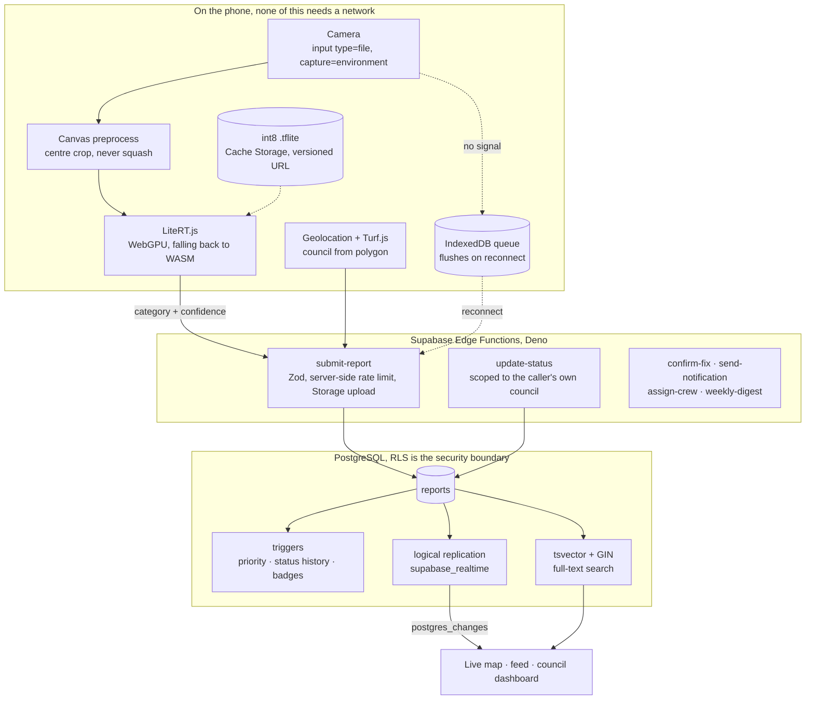

# System Architecture

**Three layers: a phone that works with no network, six Deno Edge Functions, and a PostgreSQL
schema where RLS is the security boundary rather than a setting.** One PWA, no native code.

Diagram reproduced from `README.md` § Architecture, verified against `src/lib/` and
`supabase/` on disk.

## The two shaping decisions

**The classifier runs before the upload, not after it.** Google's own LiteRT quickstart routes
inference through `@litertjs/tfjs-interop`, which drags TensorFlow.js back in purely to build
tensors, and TF.js is frozen at `4.22.0` from October 2024. Reading `@litertjs/core`'s own type
definitions showed that `CompiledModel.run(Tensor[])` and `Tensor.fromTypedArray()` are native,
so preprocessing with the Canvas API removes TF.js outright rather than swapping it.
**`@tensorflow/tfjs` is not a dependency of this project.** See
[[(Note) On-Device Classification]].

**Search shipped on Postgres, not Elasticsearch.** The plan specified an Elasticsearch index, a
sync Edge Function, a nightly re-index and a proxy, roughly **$16 a month** and an entire second
datastore for a product with zero users. A generated `tsvector` column with a GIN index covers
the same use case, and the real engineering argument is that **a generated column cannot drift
from its source**, so the sync pipeline and the re-index cease to exist rather than being
maintained. Elasticsearch is deferred, not rejected. `useSearch` is deliberately
backend-agnostic so the swap costs one file.

## The three layers, in files

| Layer | Where | State |
|---|---|---|
| Phone | `src/` (**138** files), `public/litert-wasm/`, `public/models/` | 🟢 Deployed and working |
| Edge | `supabase/functions/` (**6** Deno functions) | ⚫ Written, never deployed |
| Database | `supabase/migrations/` (**27**), `supabase/seed/`, `supabase/test/` | 🟡 Verified locally, never hosted |

The Edge and database layers are committed and reviewable. Neither has ever run against the
managed service, because Supabase project `nexccbcmziiltysfcmzi` was deleted and has
deliberately not been re-provisioned. See [[(Note) Owner-Gated Backlog]].

## Offline is a first-class path

`src/lib/offlineQueue.ts` writes to IndexedDB via `idb`, and `OfflineQueueProvider` sits at the
app root so a queued report flushes on reconnect **from anywhere in the app**. Before Sprint 6.5
the queue flushed only while the user happened to be sitting on `/report`, which meant the
feature worked exactly when it was least needed.

`pnpm verify:offline` runs **18** checks proving the model resolves from Cache Storage
byte-identical, **5,434,517 bytes** both ways, with the network cut, and that all five routes
render from cache rather than a browser error.

## Stack

`typescript` · `react@19` · `vite@8` · `react-router-dom@7` · `tailwindcss@3` ·
`@litertjs/core@2.5.3` · `mapbox-gl@3` · `@turf/turf@7` · `zustand@5` · `idb@8` ·
`framer-motion@12` · `@supabase/supabase-js@2` · `vite-plugin-pwa` · `vitest@4` ·
`playwright` · `lighthouse@13` · `zod@4` · Deno for Edge Functions · PostgreSQL 17 · Vercel.

Tailwind is pinned at **v3**, not v4, because `PRD.md` specifies v3. That is a recorded decision,
not an oversight. Note that the sibling project PULSE went the other way and runs Tailwind v4.

## Related

[[(Note) On-Device Classification]] · [[(Note) Data Model and RLS]] ·
[[(Note) The src Tree]] · [[(Note) The Five Load-Bearing Decisions]] ·
[[(Index) 10 Architecture]]
