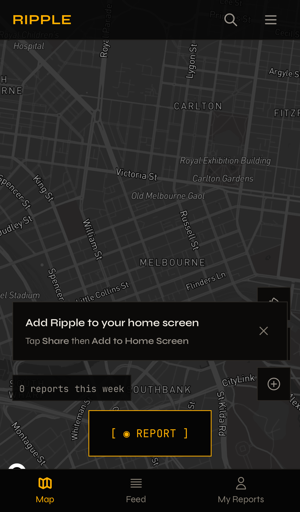
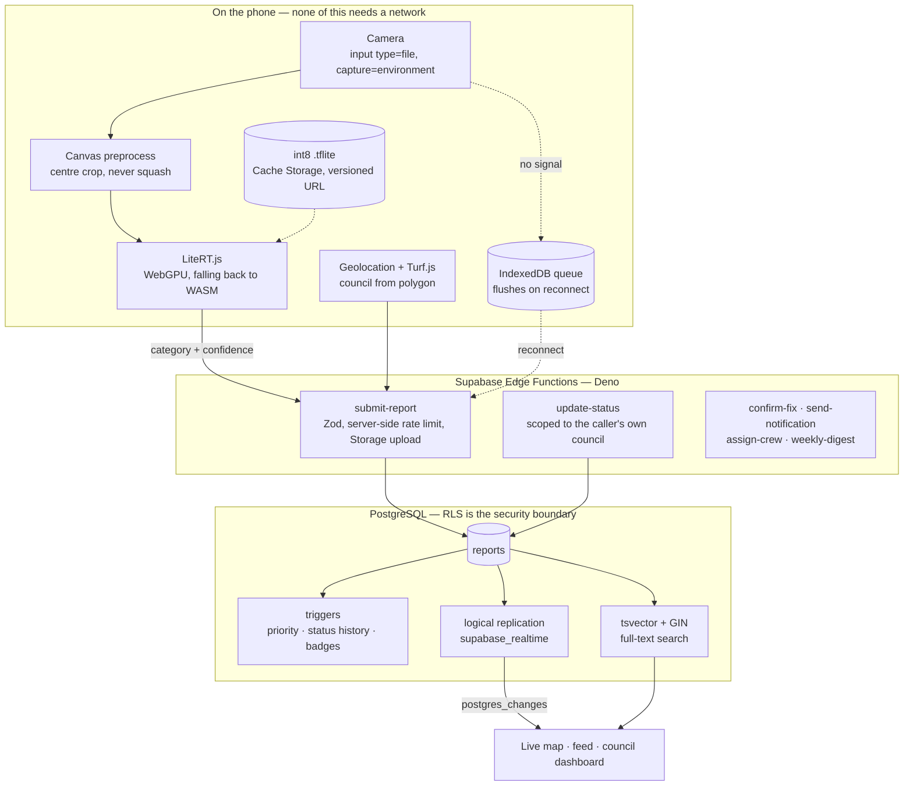

<h1 align="center">Ripple</h1>

<p align="center">
  <strong>Photograph a pothole. A classifier running on your phone files it — the image never leaves the device to be understood.</strong>
</p>

<p align="center">
  
</p>

<p align="center">
  <em>Captured from the production build by <code>pnpm capture:media</code> — real WebKit, iPhone 14 viewport, reduced motion.</em>
</p>

```bash
pnpm install && pnpm dev      # front end is live at ripple-chi-bice.vercel.app,
                              # but with no backend behind it — see Status
```

<p align="center">
  Case study: <a href="https://brunojaamaa.dev/projects/ripple">brunojaamaa.dev/projects/ripple</a>
</p>

| Gate | Result | Command |
|---|---|---|
| Unit tests | **340** across 34 files | `pnpm test:run` |
| Database | **27 migrations**, **102 assertions**, 0 failures, on real PostgreSQL 17 | `pnpm verify:db` |
| On-device inference | **p50 15 ms · p95 22 ms** against a 3,000 ms budget | `pnpm bench:ai` |
| Offline | model served **byte-identical** with the network cut; every route renders from cache | `pnpm verify:offline` |
| Installability | **28/28** criteria | `pnpm verify:pwa` |
| Mobile engines | 20 checks across real WebKit and Chromium device profiles | `pnpm verify:mobile` |
| Lighthouse, mobile preset | A11y **100** · Best Practices **96** · SEO **91** · Perf **68** | `pnpm verify:lighthouse` |

<p align="center">
  <a href="https://github.com/br9704/ripple/actions/workflows/verify.yml"></a>
  
  
  
  
  
</p>

---

## What it does

Councils have the budget to fix broken infrastructure. Citizens can see what is broken. The bridge between the two is a council web form that takes about fifteen minutes and wants a full name, address and phone number — so most problems are simply never reported.

Ripple is that bridge, rebuilt as a progressive web app with no accounts in it. You open a map of everything reported nearby, tap one control, photograph the problem, and submit. A random UUID in `localStorage` is the only identifier the system holds. There is no sign-up, no email requirement, and no way to link a report to a person.

What makes three seconds possible is that **classification happens on the phone**. An int8 `.tflite` model runs under LiteRT.js — WebGPU where available, WASM and XNNPACK where not — and returns a category and a confidence before anything is uploaded. The photo is transmitted only after Submit, and only as evidence, never as something a server has to interpret. That is a privacy architecture first and a latency win second, but it is both: measured warm inference is 15 ms at p50 against a 3,000 ms budget.

The model is treated as fallible on purpose, and the interface says so. Above 85% confidence the result card snaps in with a tick. Between 60 and 84% it types `> does this look right?` and asks. Below 60% it fans out two options and emphasises neither. If the model is missing, the runtime fails, or a browser advertises WebGPU support and then fails to compile, the app drops silently to a manual category picker — **a broken classifier never blocks a report**. Every override is recorded as `{ai_category, ai_confidence, final_category}`, which is what makes accuracy measurable later rather than merely asserted now.

Around that sit the parts that make a report worth filing: a live Mapbox map with clustering and a weighted heatmap, "I see this too" upvoting that feeds a priority score, comment threads with flag-based moderation, before-and-after photo confirmation, and an RLS-scoped council dashboard with analytics and CSV export. Reports made with no signal queue in IndexedDB and submit on reconnect from anywhere in the app.

The whole thing is one PWA. There is no React Native version, no Swift version, no Capacitor wrapper.

## Architecture



Two decisions shaped most of the rest.

**The classifier runs before the upload, not after it.** Google's own LiteRT quickstart routes inference through `@litertjs/tfjs-interop`, which drags TensorFlow.js back in purely to build tensors — and TF.js is frozen, its last release being `4.22.0` from October 2024. Reading `@litertjs/core`'s own type definitions showed that `CompiledModel.run(Tensor[])` and `Tensor.fromTypedArray()` are native, so preprocessing with the Canvas API removes TF.js outright rather than swapping it. `@tensorflow/tfjs` is not a dependency of this project.

**Search shipped on Postgres, not Elasticsearch.** The plan specified an Elasticsearch index, a sync Edge Function, a nightly re-index and a proxy — roughly $16 a month and an entire second datastore for a product with zero users. A generated `tsvector` column with a GIN index covers the same use case, and the real engineering argument is that **a generated column cannot drift from its source**, so the sync pipeline and the re-index cease to exist rather than being maintained. Elasticsearch is deferred, not rejected; `useSearch` is deliberately backend-agnostic so the swap costs one file.

## How it was built

In March 2026 this repository reported twenty sprints complete. The completion criterion offered was "TypeScript and ESLint pass with zero errors" — which, for a codebase with no tests at all, measures compilation rather than correctness.

An audit in August measured the repository against its own checkmarks instead of trusting them. Seven subtask claims were individually false. There were **zero test files**, against a `CLAUDE.md` rule reading "no test, no merge". The Supabase project the entire backend was written against returned NXDOMAIN from two independent public resolvers — and because Supabase keeps paused projects resolving, that meant deleted, not paused. Every "applied to production" claim in the plan described a database that no longer existed.

What the repairs turned up was worse than the bookkeeping. GPS failure was an unrecoverable dead end: at the eight-second timeout the hook cleared its loading flag while latitude was still null, which rendered the location line as blank space and left Submit permanently disabled — no error, no way forward. All eight of the Edge Function's validation messages were unreachable, because `supabase-js` does not parse non-2xx bodies, so users saw the literal string "Edge Function returned a non-2xx status code" instead of "Note exceeds 140 character limit". The offline queue flushed only while the user happened to be sitting on `/report`. Rate limiting was `localStorage` theatre, defeated by one devtools click. And two RLS policies named `_own` were written `USING (true)`, meaning any anonymous caller could delete anyone's upvote and every stored notification email was world-readable.

Then execution replaced assertion. A throwaway local PostgreSQL harness now applies every migration and attacks the result as `anon`, and it caught a real defect on its first run: migration 017 called `calculate_priority(NEW.id)` from a `BEFORE UPDATE` trigger, where the table still holds the old row — so the function re-read the status it was in the middle of replacing, and the status penalty never applied. That is precisely the bug the migration exists to fix, reintroduced one line below the comment describing it. Invisible to code review, and it would have been invisible in production too, in the direction that keeps resolved reports ranked as urgent on a council dashboard.

Those two RLS policies were rewritten, and the fix was recorded as proven by attack. It was not. A later audit ran the whole chain rather than its second half and found `reports.reporter_token` world-readable — RLS is row-level, and a policy of `USING (true)` filters no columns. A token could be harvested off the public map, replayed as the `x-reporter-token` header, and used to read a stranger's notification email and delete their upvote. All four steps succeeded. The migration's own header comment asserted, in writing, that tokens were not handed out.

Repairing it produced the sharpest detail in the repository. The obvious spelling — `REVOKE SELECT (reporter_token) ON reports FROM anon` — **does nothing** when a table-level `GRANT SELECT` already exists. Table-level and column-level privileges live in separate ACLs, and a column revoke cannot subtract from a table grant. It raises no error and reports success. Written that way, the migration, its comment, and the plan entry describing it would all have asserted a fix that did not exist, and nothing short of an after-the-fact attack would have noticed.

This documentation pass ran the gates rather than reading them, and found three more. **`pnpm build` was broken at `HEAD`** — a type error in the LiteRT wrapper — because the recorded gate ran `npx vite build`, which skips `tsc -b`, and `npx tsc --noEmit` against the *root* `tsconfig.json`, which is a solution file containing `"files": []` and therefore typechecks zero files while exiting 0. **The service worker served the offline page to online users**: `navigateFallback` pointed at `/offline.html`, and a workbox `NavigationRoute` matches every navigation, so with the worker in control, every route but `/` returned "You're offline right now" over a working network. It hid because `/` matches the precached shell directly and because in-app link clicks issue no navigation request — leaving broken exactly the deep-link surface that shared reports and shareable filtered views exist to provide. And the **Lighthouse score on record was a desktop-preset number**; on the mobile preset this product actually targets, Performance is 68, not 92.

Fixing the typecheck gate paid for itself within the hour: made real, it immediately caught seven errors that had been invisible, and the fix for *those* was to move tests into their own TypeScript project rather than grant the app Node types — because a component that imported `fs` would otherwise typecheck cleanly and fail only in a browser.

The last one is the most on-the-nose. Measuring the palette against the background found three colour tokens below the WCAG AA contrast floor that `PRD.md` requires — in an app whose stated purpose includes reporting accessibility hazards. The first attempt at the fix changed nothing a user would ever see, because the palette is defined in three places and only one was edited. One of the failing values had already been found and fixed once before, in a different token, with the measurement still sitting in a comment beside it. And **Lighthouse scored Accessibility 100 throughout** — because it grades what is painted on the route it audits, and a declined report is not on the feed's first screen. That 100 is real, and it means "nothing failing was visible", not "nothing fails".

Every one of these has the same shape. The RLS tests declared the attacker's token as a literal fixture, so they proved the attack failed without ever testing whether the credential could be obtained. The typecheck gate checked zero files. The PWA check used the regex `/navigateFallback|offline\.html/`, which accepts either answer and could therefore never detect the wrong one. A column revoke that cannot subtract from a table grant reports success either way. All four were green, and not one of them could have failed.

The question worth asking of any gate is **what would this have to look like to fail?** If there is no answer, it is not a gate. The full record — every deferral with its reason, every as-shipped delta, and every claim that was corrected — is in [`MASTERPLAN.md`](MASTERPLAN.md). It is deliberately not a clean story.

## Verification

Nothing below is quoted from memory. Each row names the command that produces it, and every command is in `package.json`.

| Command | What it proves |
|---|---|
| `pnpm test:run` | **340 tests across 34 files** — classification tiers at their exact boundaries, council detection including the overlap tie-break, CSV formula-injection escaping, contrast ratios computed from the files on disk, and the filter and sort predicates shared by map and feed so the two cannot disagree |
| `pnpm lint` | 0 errors, 0 warnings, 0 blanket suppressions, under `strictTypeChecked` and `stylisticTypeChecked` type-aware linting, with rule triage documented in `eslint.config.js` |
| `pnpm build` | `tsc -b` across three TypeScript projects, then Vite. Service worker emitted, 37 MB of LiteRT WASM correctly excluded from precache, no server-side secret name present in the bundle |
| `pnpm verify:db` | **27 migrations** applied to a throwaway PostgreSQL 17.11, seed loaded, **102 assertions** — 34 behavioural, 37 coverage-closure, 26 RLS, 5 Realtime — 0 failures |
| `pnpm verify:pwa` | **28/28** installability criteria: manifest, icons on disk, fetch handler, precache, navigation fallback bound to the app shell, pinch-zoom permitted, and the four `apple-*` tags iOS uses *instead of* the manifest |
| `pnpm verify:mobile` | 20 checks under real iPhone 14 (WebKit) and Pixel 7 (Chromium) profiles: `capture="environment"` present, 64×64 shutter against a 60 pt minimum, zero horizontal overflow |
| `pnpm verify:offline` | 18 checks. The model resolves from Cache Storage byte-identical — 5,434,517 bytes both ways — with the network cut, and all five routes render from cache rather than a browser error |
| `pnpm bench:ai` | Real LiteRT WASM against a real EfficientNet-Lite0 int8 `.tflite` in a real browser |
| `pnpm verify:lighthouse` | Both form factors, full reports written to [`docs/evidence/`](docs/evidence/) |

### The security assertions, specifically

Running as `anon` with RLS enforced, the suite first attempts to **harvest** a reporter token from every table that exposes its rows publicly, then attempts to replay whatever it got. The chain is asserted broken at the harvest, not at the replay — and before asserting that zero rows were harvested, the harness asserts those tables are **non-empty**, so the test cannot pass by having nothing to attack.

Four of the ten tables carrying a reporter token expose their rows publicly; those four are protected by column-level privileges. The other six are covered by row policies — scoped to the caller's own token, or RLS-on-with-no-policies for the referral tables, where a readable code-to-token mapping would be a token dictionary. Each of those six is confirmed non-empty and still invisible to `anon`, because "returns nothing" proves nothing about an empty table.

Proven this way: an attacker cannot obtain a reporter token, delete another token's upvote, read another token's notification email, forge comment authorship, or post as the council — while reports stay publicly readable, anonymous submission still works, and a user can still see their own upvote and notification settings.

### On-device inference

| | |
|---|---|
| accelerator | WebGPU, falling back to WASM/XNNPACK |
| model | EfficientNet-Lite0 int8, 5.18 MB |
| **inference p50** | **15 ms** |
| **inference p95** | **22 ms** over 20 runs |
| runtime load + compile | ~65 ms, once per session |
| cold first-ever run | ~100 ms end to end |
| MOTION.md budget | 3,000 ms |

Measured on Apple Silicon with the WebGPU accelerator. **This is a lower bound, not a phone number.** Allowing a mid-range Android to be 20–30× slower puts the warm path near 300–660 ms, still inside budget — but a representative-hardware figure is not claimed until it is measured on representative hardware.

### Lighthouse

| Preset | Performance | Accessibility | Best Practices | SEO |
|---|---|---|---|---|
| **mobile** — 4G, Moto G Power class CPU | **68** | **100** | **96** | **91** |
| desktop — unthrottled | 96 | 100 | 96 | 91 |

Both runs are committed in full to [`docs/evidence/`](docs/evidence/). The mobile run is the one that counts for a 375px-first product, and it is **below the project's own ≥90 gate**, so `pnpm verify:lighthouse` exits non-zero. FCP is 4.7 s and LCP 5.6 s under 4G throttling; CLS is 0 and TBT is 0 ms on both presets, so this is transfer weight, not main-thread work — consistent with the first-load finding in Limitations. The desktop number is included because a single score with no form factor attached is how the earlier 92 came to be quoted as though it were the whole picture.

The map route is not scored: headless Chrome software-rasterises Mapbox GL through SwiftShader, which measures the test harness rather than the app. That number needs a real phone.

## Usage

```bash
pnpm install
pnpm test:run                     # 340 tests, no configuration needed
cp .env.example .env.local        # Supabase URL and anon key, Mapbox token
pnpm dev
```

Tests need no setup: `.env.test` is committed with deliberately non-resolving placeholder values, because a suite that only runs for the person who wrote it is not a verified suite. That was not true until CI said so — on a clean clone this repo produced 324 tests and a failure, not 340.

The model is not in git — `public/models/*.tflite` is gitignored because it is 5 MB and reproducible from a URL. `pnpm build` fetches it via `prebuild`, so a clean checkout still produces a complete bundle; the fetch is idempotent and skips when the file is already there. `pnpm dev` does not, so a fresh dev server takes the designed fallback path to the manual category picker until you ask for the model:

```bash
pnpm fetch:model                  # real EfficientNet-Lite0 int8, 5.18 MB
pnpm bench:ai
```

The database layer verifies with no cloud account and no spend. It provisions a throwaway local PostgreSQL, applies every migration, loads the seed, and then attacks the result:

```bash
brew install postgresql@17 && brew services start postgresql@17
pnpm verify:db
```

| Command | Purpose |
|---|---|
| `pnpm dev` · `pnpm build` · `pnpm preview` | Develop, build, serve the production build |
| `pnpm test` · `pnpm test:run` · `pnpm coverage` | Vitest — watch, once, with coverage |
| `pnpm verify` | Tests, lint, build, PWA, mobile engines, offline — the full local gate |
| `pnpm verify:db` | Migrations, triggers, RLS and Realtime against real PostgreSQL |
| `pnpm verify:lighthouse` | Both form factors; writes `docs/evidence/` |
| `pnpm capture:media` | Regenerates `docs/media/` from the current build |
| `pnpm fetch:model` · `pnpm bench:ai` | Fetch the development classifier, benchmark inference |

### Environment

Every client-safe value carries the `VITE_` prefix and nothing else ever may. Server-side secrets live only in Supabase Edge Function secrets. The full table, with where each value comes from, is in [`.env.example`](.env.example).

| Variable | Scope |
|---|---|
| `VITE_SUPABASE_URL` · `VITE_SUPABASE_ANON_KEY` | client |
| `VITE_MAPBOX_TOKEN` | client — public by design; restrict by URL referrer in the Mapbox dashboard rather than trying to hide it |
| `VITE_VAPID_PUBLIC_KEY` | client, optional (Web Push) |
| `SUPABASE_SERVICE_ROLE_KEY` · `RESEND_API_KEY` · `VAPID_PRIVATE_KEY` | **server only** |

## Limitations

**The front end is deployed; the backend does not exist.** [ripple-chi-bice.vercel.app](https://ripple-chi-bice.vercel.app) serves the real build — the PWA installs, the map renders, the offline shell works, and the on-device classifier loads its 5,434,517-byte model from the CDN. **Nothing that reads or writes data works.** The Supabase project this was built against was deleted and has deliberately not been re-provisioned, so reports do not load or submit. Every schema-layer claim above is verified against local PostgreSQL, but Storage uploads, Edge Function deployment, Auth flows and Realtime *delivery* are managed services with no local stand-in. Those remain unproven, and the tasks depending on them are marked as such rather than as complete.

Two deploy-only defects surfaced the moment it was live, both invisible to every local gate. The build shipped **no classifier** from a clean checkout — the model is gitignored and nothing fetched it, so `pnpm build` exited 0 on an incomplete bundle; it is fetched in `prebuild` now. And **seven of eight routes returned 404**, because there was no `vercel.json` and the CDN looked for a file at `/feed`. Both hid for the same reason: `vite preview` implements history fallback itself, in-app `<Link>` navigation issues no network request, and once the service worker installs it serves the shell anyway — so only cold loads and shared links broke. Which is to say: only strangers.

**No accuracy claim is made for the classifier.** The pipeline is complete and benchmarked, but the model it ships with is a generic EfficientNet-Lite0 carrying **ImageNet's thousand classes, not Ripple's ten categories**. It proves the runtime loads, the cache works and the latency is real; its predictions are not civic-meaningful. A production build ships that model, so classification *runs* — it is simply not yet trustworthy, which is exactly why the confidence tiers and the one-tap override exist. The fine-tuned model needs roughly 500 images per category across ten categories. Until it lands, the ">70% correct without correction" target in the PRD is unmet and unmeasured, and swapping it in is a one-URL change by design, because the filename is versioned.

**First load is heavier than the PRD budget.** The LiteRT WASM runtime is about 2 MB gzipped and the model about 5 MB, putting first load near 7 MB against a stated "<5 s on 4G". The original stack comparison counted model sizes only and omitted the runtime entirely. The mitigations are real — the model loads lazily, never blocks a report, and is cached after first use — but the budget is exceeded, and mobile Lighthouse Performance reflects it.

**Council boundaries are placeholder bounding boxes**, not ABS polygons, and they overlap. Correctness no longer *depends* on row order — detection falls back to nearest centroid and the query is explicitly ordered — but attribution near a boundary is approximate until real data lands.

**Accessibility is verified in the places it was measured, not everywhere.** Contrast is now computed from the files on disk and gated in CI, focus styles and screen-reader labels are in place, and map pins have a parallel keyboard-navigable list because a `<canvas>` has no accessibility tree. A full VoiceOver and TalkBack sweep needs a device and has not happened.

**Some things are irreducibly manual.** No automation can tap Share → Add to Home Screen on a physical iPhone, confirm that the OS camera app actually opened, or measure frame rate on a mid-range Android. Everything that *determines* those outcomes is checked; the last tap is not.

**Deliberately not built:** Elasticsearch (cost, deferred with a documented swap path); school-proximity clustering for council alerts (needs a POI dataset this schema does not have, and a proxy would produce alerts nobody could act on); a CRT and scanline treatment (wrong for a civic tool used outdoors one-handed, where legibility beats texture); native apps of any kind.

## Status

Every task in the plan is closed — 255 of 255 — and the tree is green: 340 tests, 0 lint errors, `pnpm build` exits 0, and 102 database assertions pass against real PostgreSQL. The front end is live at [ripple-chi-bice.vercel.app](https://ripple-chi-bice.vercel.app). What is *not* claimed is that the data layer has run in production, because it has not — there is no backend behind that URL.

What remains is owner-gated rather than unfinished: re-provisioning Supabase, training the civic classifier, sourcing ABS boundary data, filling in the Terms page's twelve legal placeholders, and holding a phone. Each is named — with what was built anyway, so that it becomes a swap rather than a build — in the [Owner-Gated Backlog](MASTERPLAN.md#owner-gated-backlog--deferred-to-the-very-end).

None of those blockers is cost. Supabase and Vercel both have free tiers that cover this comfortably; the only genuinely paid item in the plan was Elasticsearch, and Sprint 12 replaced it with Postgres full-text. What the gates actually need is account access, a training dataset, and a physical handset.

## Documentation

| Document | What is in it |
|---|---|
| [`MASTERPLAN.md`](MASTERPLAN.md) | Sprint-by-sprint record, as-shipped deltas, every deferral with its reason, architecture decision log |
| [`PRD.md`](PRD.md) | Feature specs, data models, personas, privacy rules, screen specs |
| [`MOTION.md`](MOTION.md) | Binding animation specification — timings, per-surface rules, acceptance gates |
| [`CLAUDE.md`](CLAUDE.md) | Engineering contract: standards, privacy rules, sprint protocol |
| [`public/models/README.md`](public/models/README.md) | How to produce and drop in the classifier |
| [`docs/evidence/`](docs/evidence/) | Committed Lighthouse reports, both form factors |

## License · Author

All rights reserved — see [`LICENSE`](LICENSE). The code is public to read, not to reuse.

Built by [Bruno Jaamaa](https://brunojaamaa.dev) · [@br9704](https://github.com/br9704)
